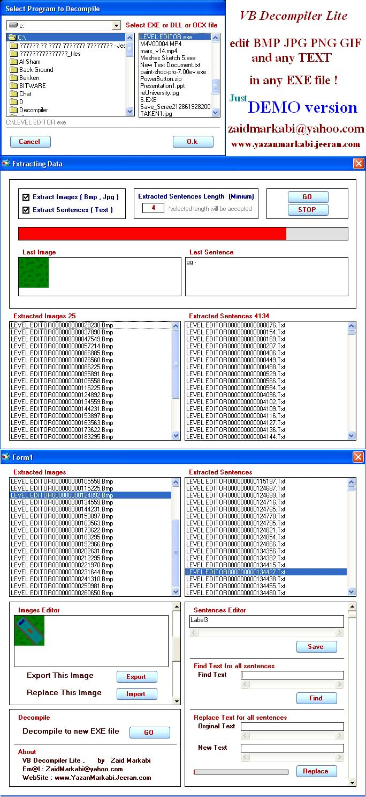

<div align="center">

## VB6 Decompiler \- Updated \- with source


</div>

### Description

VB Decompiler is decompiler for programs (EXE, DLL or OCX) written in Visual Basic 5.0 and 6.0. As you know,

programs in Visual Basic can be compiled into interpreted p-code or into native code.

If a program was compiled into the native code, restoring full source code from machine instructions is not possible.

anyway you can edit any text or image which contained in EXE file .

Just select EXE file, then edit any text and pictures, then compile edited data to new EXE file .
 
### More Info
 


<span>             |<span>
---                |---
**Submitted On**   |2009-01-10 12:51:30
**By**             |[Zaid Markabi](https://github.com/Planet-Source-Code/PSCIndex/blob/master/ByAuthor/zaid-markabi.md)
**Level**          |Advanced
**User Rating**    |5.0 (15 globes from 3 users)
**Compatibility**  |VB 5\.0, VB 6\.0
**Category**       |[Complete Applications](https://github.com/Planet-Source-Code/PSCIndex/blob/master/ByCategory/complete-applications__1-27.md)
**World**          |[Visual Basic](https://github.com/Planet-Source-Code/PSCIndex/blob/master/ByWorld/visual-basic.md)
**Archive File**   |[VB6\_Decomp2153235262009\.zip](https://github.com/Planet-Source-Code/zaid-markabi-vb6-decompiler-updated-with-source__1-72111/archive/master.zip)

### API Declarations

```
VB Decompiler is decompiler for programs (EXE, DLL or OCX) written in Visual Basic 5.0 and 6.0. As you know,
programs in Visual Basic can be compiled into interpreted p-code or into native code.
If a program was compiled into the native code, restoring full source code from machine instructions is not possible.
anyway you can edit any text or image which contained in EXE file .
Just select EXE file, then edit any text and pictures, then compile edited data to new EXE file .
```


